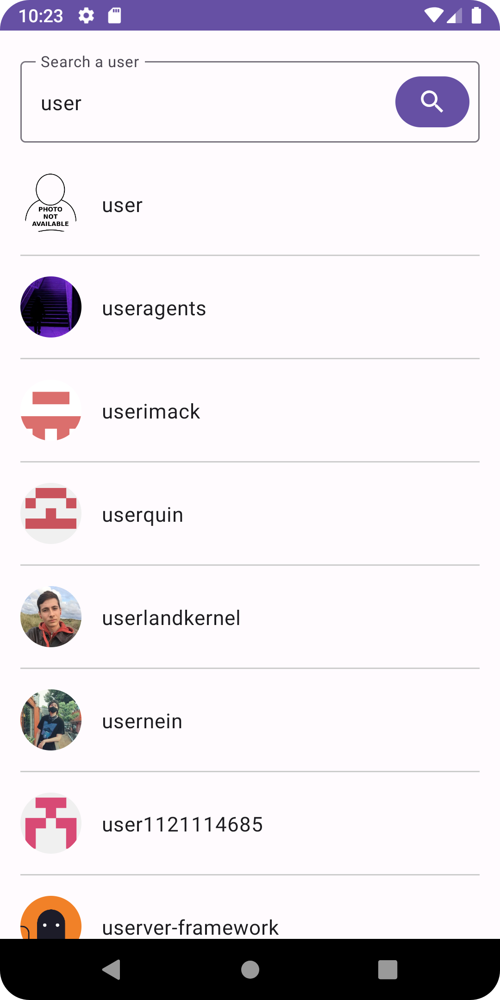
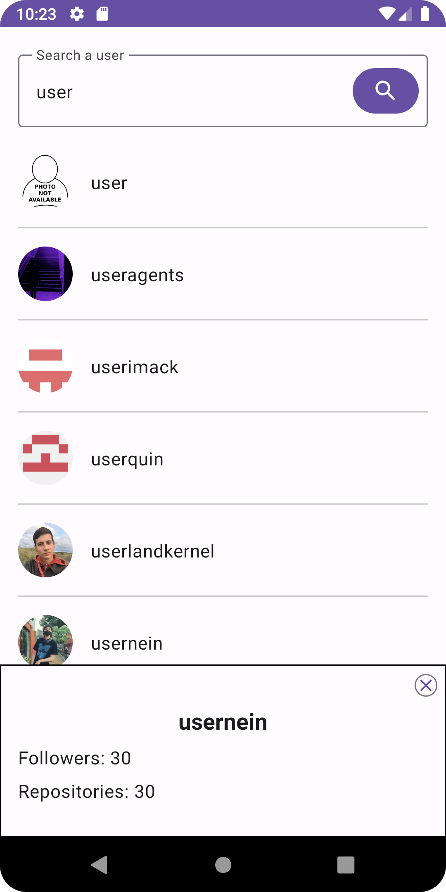

# AxelDemo
**Coding Challenge Task**

A basic Android app that allows users to search for GitHub users and view their details.

#### Technologies and Tools 

- Kotlin 
- Model-View-ViewModel (MVVM) architectural pattern
- Clean Architecture 
- Multi Module
- Hilt for dependency injection
- Retrofit for network calls
- Coroutine for asynchronous operations
- Flow for handling data asynchronously and  
- Jetpack Compose for building UI
- Coil for image loading
- Mockito for unit testing
- Kotest for unit testing

#### Screenshots

      
